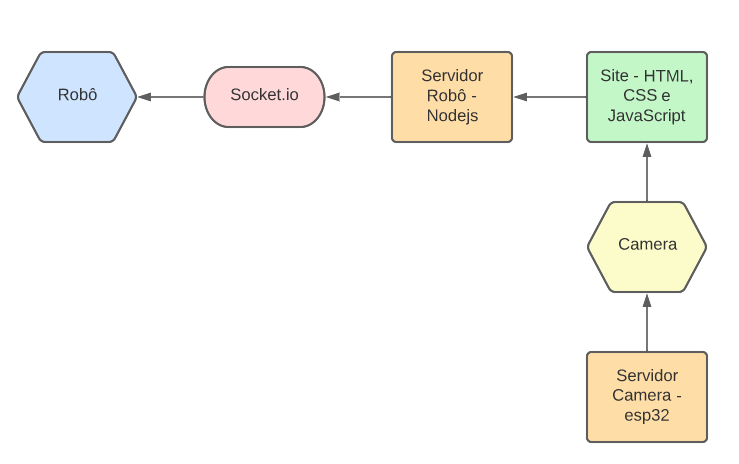
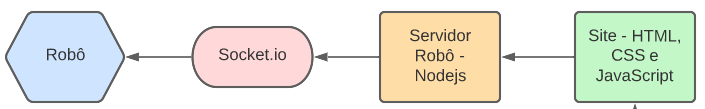
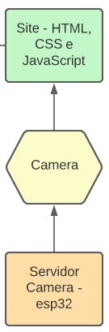

# Robô identificador de objetos controlado remotamente

## Contexto

Nós, alunos do sétimo período de engenharia de computação, desenvolvemos um projeto que integre hardware e software. Para isso criamos um robô que se movimenta a partir de comandos enviados pelos dispositivos conectados a rede. O robô, além de se movimentar, possui uma câmera acoplada na frente do mesmo que, por meio de inteligência artificial, consegue detectar os objetos em cena. O objetivo final do projeto é desenvolver um robô controlado remotamente que transmitirá imagens em tempo real para identificação de objetos em locais de difícil acesso utilizando rede wifi.

A motivação por tras do projeto consiste no fato de que existem ambientes em que o acesso é de extrema dificuldade para humanos e a existencia de um robo para fazer o reconhecimento desse tipo de ambiente é de muita relevância, pensando nisso, pensamos em desenvolver uma aplicação que possibilatasse humanos a terem controle e visão nesse tipo de ambiente.

## Componentes

- ESP32 cam (usada como câmera)
- ESP 8266 (usada para controlar o robô
- Base do robô
- Ponto H
- Pacote de pilhas
- Power Bank
- Jumpers
- Protoboards

## Como executar

1. Faça um fork desse projeto
1. Altere as configurações de wifi nos arquivos _cam/cam.ino_ e _car/wifi.cpp_
1. Faça o upload desses código com Arduino IDE
1. Entre na pasta _car/carrinho_servidor_ e digite `npm run dev` para executar o servidor
1. Entre na pasta _car/site_ e digite `npm run dev` para executar o site
1. Abra seu navegador em localhost:3000 e controle o robô

## Fluxo da aplicação

Um fluxograma geral da aplicação é mostrada abaixo:

 

 

A partir dos Site Web (feito com HTML, CSS e javaScript) são enviados comandos para o servidor do Robô (feito em Node) e neste, por meio de uma comunicação feita com Socket.io enviamos os comandos para o Robô programado em uma placa Esp8266 com um .ino.

Os comandos enviados ao robo são feitos utilizando um joystick implementado em uma aplicação web feita por meio da biblioteca **react-joystick-component**.

Implementamos ao todo 4 comandos:

- Frente:
  Para fazermos a movimentação do carrinho para frente, enviavamos ao servidor, por meio de um array a informação "F F", para indicar que ambas as rodas iriam rodar no sentido para frente.

- Trás:
  Para fazermos a movimentação do carrinho para tras, enviavamos ao servidor, por meio de um array a informação "T T", para indicar que ambas as rodas iriam rodar no sentido para tras.

- Direita:
  Para fazermos a movimentação do carrinho para a direita, enviávamos ao servidor, por meio de um array a informação "F P", para indicar que uma das rodas vai parar o movimento de rotação e a outra vai movimentar-se para frente, efetuando assim o movimento de curva para a direita.

- Esquerda:
  Para fazermos a movimentação do carrinho para a esquerda, enviávamos ao servidor, por meio de um array a informação "P F", para indicar que uma das rodas vai parar o movimento de rotação e a outra vai movimentar-se para frente, efetuando assim o movimento de curva para a esquerda.

 

 

Ademais, acoplamos também uma Esp32cam rodando como um servidor independente para fazer a captura das imagens.

 

 

Todas a programação das placas, tanto da esp32 quanto da esp8266 foram feitas utilizando o software ArduinoIDE.

## Tecnologias

**Robô**

- Programação C++

**Servidor Robô**

- NodeJs

**Site web**

- HTML, CSS e Javascript

**Câmera**

- Programação C++

**Servidor Câmera**

- Colocamos a esp32 para funcionar como um servidor e configuramos na rede do roteador que utilizamos.

## Diretório Cam

Neste diretório encontrasse o arquivo _cam.ino_ que possui a implementação em C/C++ da camera. A implementação do código pode ser resumida nos seguintes passos:

- Conexão com a rede WiFi fornecida.
- Indexação da biblioteca Tensorflow para fazer o reconhecimento de objetos através do modelo coco-ssd, a captura sendo feito em video.
- Criação de uma interface em HTML para interação do usuário com o objeto.

## Diretório Car

Neste diretório encontram-se os diretórios _carrinho_, _carrinhoservidor_ e _site_.

### Carrinho

Implementação da lógica de movimentação do robô, onde fazemos a comunicação via SocketIO com o servidor. Recebemos o comando do servidor através de um array de 2 posições que indicam qual movimento as rodas devem realizar

### Carrinho Servidor

Servidor construido com JavaScript que serve como ponte entre o site e o diretório _carrinho_, pois o servidor recebe o movimento do joystick vi
ndo do site e emite um sinal de comando para o carrinho com o array de posições citado anteriormente

### Site

Interface construida com NextJS para interação do usuário, onde temos a visualização da câmera e os objetos detectados pelo robô, bem como um joystick que envia os movimentos do robô. Para a comunicação com o servidor, também usamos o SocketIO

## Considerações finais

Por meio deste trabalho foi possível aplicar inúmeros conhecimentos estudados durante o curso de Engenharia de Computação, aplicando tanto os conhecimentos das matérias da Elétrica, que auxiliaram na parte do desenvolvimento do hardware, quanto as de programação que auxiliaram no desenvolvimento do software da aplicação. Neste trabalho foi aplicado também, a habilidade de solucionar problemas, uma vez que em projetos de hardware e software é comum haver imprevistos durante a montagem. Além disso, um ponto importante para se detalhar, é que decidimos utilizar 2 microcontroladores ESP para evitar problemas relacionados ao processamento da imagem e controle do robô, assim conseguimos criar duas unidades independentes como mostradas nos esquemáticos apresentados nesse projeto.

Para a alimentação do projeto optamos por utilizar 4 pilhas AA para alimentar a ponte H, responsável pelos 2 motores DC do robô. Para os dois microcontroladores (ESP8266 e ESP32) optamos por utilizar uma powerbank convencional, entretanto o modelo do dispositivos que utilizamos era relativamente grande para o projeto, porém foi constatado que nem o peso e nem o tamanho impediriam o bom desempenho do projeto, portanto, por questões de custo, optamos por trabalhar com ele ao invés de utilizar uma pilha de 9V acolpada em um circuito limitador de tensão.

## Autores

| [ Emerson Laranja](https://github.com/EmersonLaranja) | [ Gabriel Simoura](https://github.com/gabrielSSimoura) | [ Maria Armini](https://github.com/maluarmini) |
| :-------------------------------------------------------------------------------------------------------------------------------------------: | :--------------------------------------------------------------------------------------------------------------------------------------------: | :------------------------------------------------------------------------------------------------------------------------------------: |
