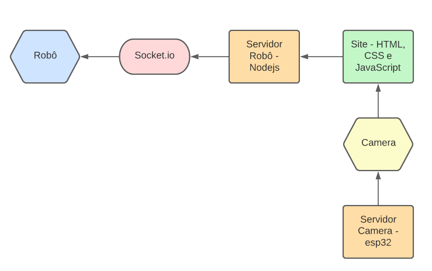
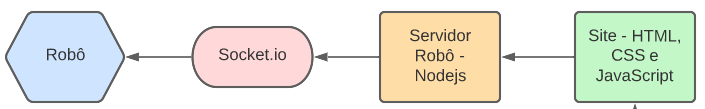

# Robô identificador de objetos controlado remotamente
## Contexto
Nós, alunos do sétimo período de engenharia de computação, desenvolvemos um projeto que integre hardware e software. Para isso criamos um robô que se movimenta a partir de comandos enviados pelos dispositivos conectados a rede. O robô, além de se movimentar, possui uma câmera onde, por inteligência artificial, ele consegue detectar os objetos em cena. Nosso objetivo final é um robô controlado remotamente que transmitirá imagens para identificação de objetos em locais de difícil acesso utilizando rede wifi.


##  Componentes
* ESP32 cam (usada como câmera)
* ESP 8266 (usada para controlar o robô
* Base do robô
* Ponto H
* Pacote de pilhas
* Power Bank
* Jumpers
* Protoboards


## Como executar
1. Faça um fork desse projeto
1. Altere as configurações de wifi nos arquivos *cam/cam.ino* e *car/wifi.cpp*
1. Faça o upload desses código com Arduino IDE
1. Entre na pasta *car/carrinho_servidor* e digite ```npm run dev``` para executar o servidor
1. Entre na pasta *car/site* e digite ```npm run dev``` para executar o site
1. Abra seu navegador em localhost:3000 e controle o robô 


## Fluxo da aplicação
Um fluxograma geral da aplicação é mostrada abaixo:
 <div align="center">
 
</div>

A partir dos Site Web (feito com HTML, CSS e javaScript) são enviados comandos para o servidor do Robô (feito em Node) e neste, por meio de uma comunicação feita com Socket.io enviamos os comandos para o Robô programado em uma placa Esp8266 com um .ino.
 <div align="center">
 
</div>


Ademais, acoplamos também uma Esp32cam rodando como um servidor independente para fazer a captura das imagens.

 <div align="center">
 
</div>


Todas a programação das placas, tanto da esp32 quanto da esp8266 foram feitas utilizando o software ArduinoIDE.

## Tecnologias

**Robô**
* Programação C++

**Servidor Robô**
* NodeJs

**Site web**
* HTML, CSS e Javascript

**Câmera**
* Programação C++

**Servidor Câmera**
* Colocamos a esp32 para funcionar como um servidor e configuramos na rede do roteador que utilizamos.


## Considerações finais
Decidimos por usar 2 microcontroladores ESP para evitar problemas relacionados ao processamento da imagem e  controle do robô.

## Autores

| [<br><sub>Emerson Laranja</sub>](https://github.com/EmersonLaranja) |  [<br><sub>Gabriel Simoura</sub>](https://github.com/gabrielSSimoura) | [<br><sub>Maria Armini</sub>](https://github.com/maluarmini) |
| :---: | :---: | :---: |

